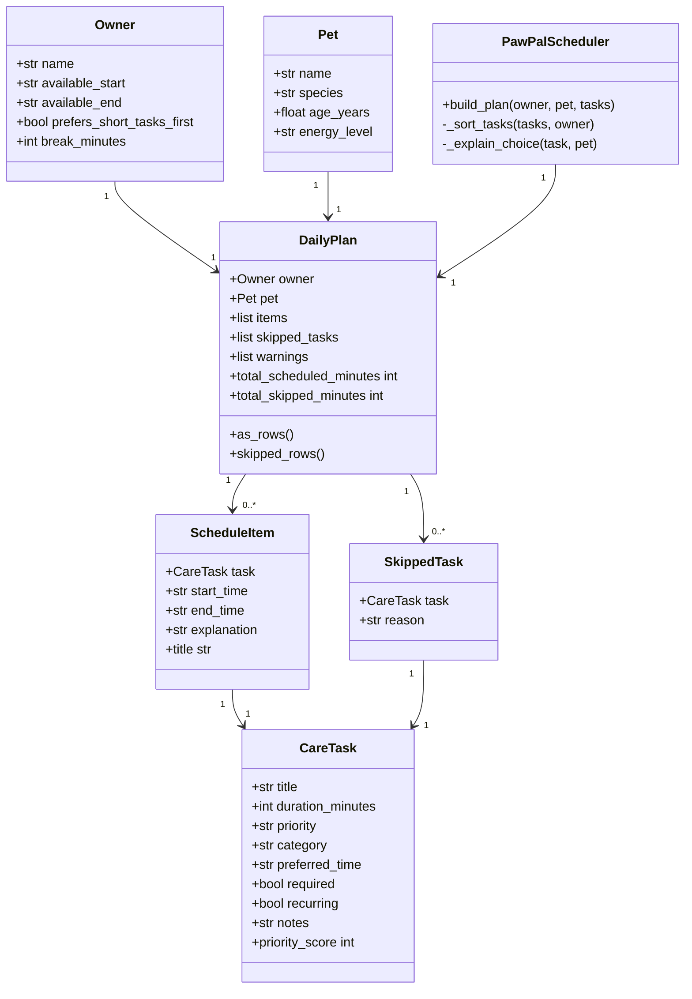

# PawPal+ (Module 2 Project)

You are building **PawPal+**, a Streamlit app that helps a pet owner plan care tasks for their pet.

PawPal+ is a pet care planning assistant for busy pet owners. It lets a user enter owner information, pet information, and daily care tasks. Then it generates a clear daily schedule based on task priority, available time, required status, recurrence, preferred time of day, and owner preferences.

---

## Scenario

A busy pet owner needs help staying consistent with pet care. They want an assistant that can:

- Track pet care tasks (walks, feeding, meds, enrichment, grooming, etc.)
- Consider constraints (time available, priority, owner preferences)
- Produce a daily plan and explain why it chose that plan

My version of PawPal+ handles this by separating the project into two layers:

- `app.py` handles the Streamlit user interface.
- `pawpal.py` handles the scheduling logic and data model.

This keeps the app easier to test, debug, and explain.

---

## What you will build

Your final app should:

- Let a user enter basic owner + pet info
- Let a user add/edit tasks (duration + priority at minimum)
- Generate a daily schedule/plan based on constraints and priorities
- Display the plan clearly (and ideally explain the reasoning)
- Include tests for the most important scheduling behaviors

My final implementation includes:

| Area | What was implemented |
|---|---|
| Owner info | Owner name, available start/end time, break time between tasks |
| Pet info | Pet name, species, age, and energy level |
| Task management | Add, edit, delete, clear, and load demo tasks |
| Task details | Title, duration, priority, category, preferred time, required status, recurrence, and notes |
| Scheduling | Generates a non-overlapping daily plan |
| Constraints | Time available, priority, required status, recurrence, preferred time, break time, and owner preference |
| Explanations | Explains why each task was scheduled or skipped |
| Export | Download scheduled tasks and skipped tasks as CSV files |
| Testing | Pytest tests for the core scheduling behavior |
| Extra polish | UML diagram, smarter scheduling table, demo walkthrough, coverage support |

---

## Getting started

### Setup

```bash
python -m venv .venv
source .venv/bin/activate  # Windows: .venv\Scripts\activate
pip install -r requirements.txt
```

For Windows PowerShell, use:

```powershell
.\.venv\Scripts\Activate.ps1
```

If PowerShell blocks script activation, run this first:

```powershell
Set-ExecutionPolicy -Scope Process -ExecutionPolicy Bypass
```

Then activate again:

```powershell
.\.venv\Scripts\Activate.ps1
```

You can also run commands without activating the environment:

```powershell
.\.venv\Scripts\python.exe -m pip install -r requirements.txt
.\.venv\Scripts\python.exe -m pytest -q
```

---

## Running the app

Start the Streamlit app with:

```bash
python -m streamlit run app.py
```

Then open the local Streamlit link in your browser.

---

## Suggested workflow

1. Read the scenario carefully and identify requirements and edge cases.
2. Draft a UML diagram (classes, attributes, methods, relationships).
3. Convert UML into Python class stubs (no logic yet).
4. Implement scheduling logic in small increments.
5. Add tests to verify key behaviors.
6. Connect your logic to the Streamlit UI in `app.py`.
7. Refine UML so it matches what you actually built.

For this project, I followed that workflow by first designing the main classes, then building the backend scheduler in `pawpal.py`, then connecting it to the Streamlit interface in `app.py`, and finally adding tests and documentation.

---

## UML / System Design

The final design uses separate classes for the user, pet, tasks, scheduled results, skipped results, and scheduler.



---

## Design explanation

My initial design focused on three main classes:

- `Owner`
- `Pet`
- `CareTask`

During implementation, I added more result-focused classes:

- `ScheduleItem`
- `SkippedTask`
- `DailyPlan`
- `PawPalScheduler`

This made the design stronger because the scheduler does not just return a plain list of tasks. It returns a complete daily plan with scheduled tasks, skipped tasks, warnings, total scheduled minutes, total skipped minutes, and table-ready rows for Streamlit.

This separation also makes the project easier to test because the scheduling logic can be tested directly without opening the Streamlit app.

---

## Scheduling logic

PawPal+ uses a greedy scheduling algorithm.

The scheduler follows this process:

1. Validate the owner, pet, and task inputs.
2. Convert the owner’s available start and end times into minutes.
3. Skip tasks that are not recurring today.
4. Sort recurring tasks by:
   - required tasks before optional tasks,
   - high priority before medium and low priority,
   - preferred time order: morning, afternoon, evening, then any,
   - duration based on the owner’s preference,
   - task title as a final stable tie-breaker.
5. Add tasks one by one into the available time window.
6. Add break time between scheduled tasks.
7. Skip any task that does not fit.
8. Return a `DailyPlan` object with scheduled items, skipped tasks, warnings, and explanations.

This is a reasonable design for a pet care assistant because required tasks like medicine, feeding, and walks should usually happen before optional enrichment or grooming tasks.

---

## 🖥️ Sample Output

Paste a sample of your app's CLI or Streamlit output here so a reader can see what a generated plan looks like:

```text
# e.g.:
# Daily plan for Biscuit (Golden Retriever):
#   08:00 — Morning walk (30 min) [priority: high]
#   09:00 — Feeding (10 min) [priority: high]
#   ...
```

Actual PawPal+ sample output:

```text
Generated a plan for Mochi.
Scheduled 3 task(s), skipped 2 task(s).

Scheduled plan:

08:00–08:30 — Morning walk
Duration: 30 min
Priority: high
Reason: Required care task; high priority; preferred for the morning; matches a high-energy pet's need for movement; Important for exercise, bathroom needs, and high-energy pets.

08:35–08:40 — Give medication
Duration: 5 min
Priority: high
Reason: Required care task; high priority; preferred for the morning; Required health task that should not be skipped.

08:45–08:55 — Dinner feeding
Duration: 10 min
Priority: high
Reason: Required care task; high priority; preferred for the evening; Keeps meal timing consistent.

Skipped tasks:

Training practice
Duration: 25 min
Priority: medium
Reason: Not enough time left. The task needs 25 minutes, but only 0 minutes remain in the owner's available window.

Long grooming session
Duration: 45 min
Priority: low
Reason: Not enough time left. The task needs 45 minutes, but only 0 minutes remain in the owner's available window.
```

---

## 🧪 Testing PawPal+

```bash
# Run the full test suite:
pytest

# Run with coverage:
pytest --cov
```

For this project, I used:

```bash
python -m pytest -q
```

Sample test output:

```text
# Paste your pytest output here
```

Actual test output:

```text
...............                                                          [100%]
15 passed
```

Run with coverage:

```bash
python -m pytest --cov=pawpal -q
```

The tests verify:

| Test area | What it checks |
|---|---|
| Priority ordering | High-priority tasks come before lower-priority tasks |
| Required tasks | Required tasks come before optional tasks when priority is tied |
| Time limits | Tasks are skipped when there is not enough time |
| Skipped explanations | Skipped tasks include a reason |
| Recurrence | Non-recurring tasks are skipped from today’s plan |
| No overlap | Scheduled tasks do not overlap |
| Owner preference | Shorter tasks can come first when other rules are tied |
| Preferred time | Morning tasks can come before evening tasks when other rules tie |
| Empty plan | Empty task lists return a warning |
| Streamlit rows | Scheduled and skipped rows are formatted for display |
| Break time | Breaks can cause later tasks to be skipped |
| Pet energy | Pet energy level affects explanations |
| Validation | Invalid durations and invalid time windows raise errors |
| Time helpers | Time conversion functions work correctly |

---

## 📐 Smarter Scheduling

> Fill in once you've implemented scheduling logic.

| Feature | Method(s) | Notes |
|---------|-----------|-------|
| Task sorting | `PawPalScheduler._sort_tasks()` | Sorts by required status, priority, preferred time, duration preference, and title. |
| Filtering | `PawPalScheduler.build_plan()` | Skips non-recurring tasks and tasks that do not fit in the available time window. |
| Conflict handling | `PawPalScheduler.build_plan()` | Builds the plan sequentially, so scheduled tasks do not overlap. |
| Recurring tasks | `CareTask.recurring`, `PawPalScheduler.build_plan()` | Tasks marked as not recurring are skipped from today’s schedule with an explanation. |
| Priority handling | `CareTask.priority_score`, `PawPalScheduler._sort_tasks()` | Converts low, medium, and high priority into numeric ordering. |
| Owner preferences | `Owner.prefers_short_tasks_first` | Allows shorter tasks to come first when priority and preferred time are tied. |
| Breaks | `Owner.break_minutes` | Adds buffer time between tasks. |
| Explanations | `PawPalScheduler._explain_choice()` | Explains required status, priority, preferred time, pet energy fit, and notes. |
| Streamlit display | `DailyPlan.as_rows()`, `DailyPlan.skipped_rows()` | Converts backend results into table-ready rows. |

---

## 📸 Demo Walkthrough

Describe your app in numbered steps so a reader can follow along without watching a video:

1. Open the app by running `python -m streamlit run app.py`.
2. Enter the owner’s name.
3. Enter the pet’s name, species, age, and energy level.
4. Set the owner’s available start and end time.
5. Choose the break time between tasks.
6. Choose whether the owner prefers shorter tasks first when priority is tied.
7. Add a task by entering its title, duration, priority, category, preferred time, required status, recurrence, and notes.
8. Edit an existing task by expanding it in the current task list and clicking **Save task changes**.
9. Delete a task by expanding it and clicking **Delete this task**.
10. Click **Load strong demo tasks** to quickly load a realistic example.
11. Click **Generate schedule**.
12. Review the scheduled plan table.
13. Read the plain-English explanation for each scheduled task.
14. Review the skipped tasks table if the available time window is too short.
15. Download the scheduled plan as a CSV.
16. Download the skipped tasks as a CSV if any tasks were skipped.

To demonstrate skipped tasks during grading:

1. Click **Load strong demo tasks**.
2. Set the available time window to 8:00 AM–8:45 AM.
3. Keep break time at 5 minutes.
4. Click **Generate schedule**.
5. The app should schedule the highest-priority tasks that fit and skip tasks that do not fit.

**Screenshot or video** *(optional)*: <!-- Insert a screenshot or link to a demo video here -->

---

## Project files

```text
app.py                  Streamlit user interface
pawpal.py               Core classes and scheduling logic
requirements.txt        Python dependencies
README.md               Project documentation
reflection.md           Project reflection
ai_interactions.md      AI collaboration / stretch documentation
tests/conftest.py       Test import setup
tests/test_pawpal.py    Scheduler tests
```

---

## Design tradeoffs

The scheduler uses a greedy algorithm. This makes the system predictable, readable, and easy to explain.

The tradeoff is that it does not search every possible combination of tasks to find the mathematically optimal schedule. For example, an optimization algorithm might fit more total tasks by skipping one long high-priority task and selecting several shorter lower-priority tasks.

For PawPal+, this tradeoff is reasonable because clarity matters. A pet owner should be able to understand why the app prioritized required tasks like medicine, feeding, and walks before optional tasks like enrichment or grooming.

---

## Future improvements

If I had another iteration, I would add:

- multiple pets,
- exact medication due times,
- weekly recurring schedules,
- calendar export,
- drag-and-drop schedule editing,
- automatic reminders,
- pet-specific rules by species,
- saved owner and pet profiles,
- a more advanced optimization algorithm.